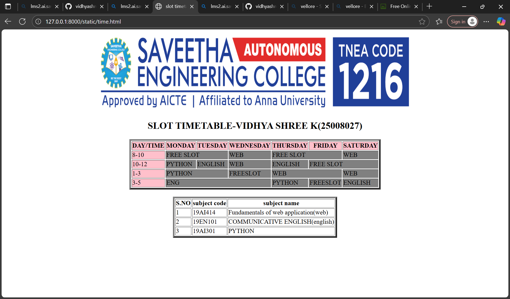

# Ex03 Time Table
## Date:20/09/2025

## AIM
To write a html webpage page to display your slot timetable.

## ALGORITHM
### STEP 1
Create a Django-admin Interface.

### STEP 2
Create a static folder and inert HTML code.

### STEP 3
Create a simple table using ```<table>``` tag in html.

### STEP 4
Add header row using ```<th>``` tag.

### STEP 5
Add your timetable using ```<td>``` tag.

### STEP 6
Execute the program using runserver command.

## PROGRAM
```
<html>
    <head>
        <title>slot timetable</title>
    </head>
    <body align="center">
        
        
        <h2 align="center">SLOT TIMETABLE-VIDHYA SHREE K(25008027)</h2>
        <table border="4" align="center">
        
            <tr bgcolor="pink">
                <th>DAY/TIME</th>
                <th>MONDAY</th>
                <th>TUESDAY</th>
                <th>WEDNESDAY</th>
                <th>THURSDAY</th>
                <th>FRIDAY</th>
                <th>SATURDAY</th>
            </tr>
            <tr>
                <td bgcolor="pink">8-10</td>
                <td colspan="2" bgcolor="grey">FREE SLOT</td>
                <td bgcolor="grey">WEB</td>
                <td colspan="2" bgcolor="grey">FREE SLOT</td>
                
                <td bgcolor="grey">WEB</td>
            </tr>
            <tr>
                <td bgcolor="pink">10-12</td>
                <td bgcolor="grey">PYTHON</td>
                <td bgcolor="grey">ENGLISH</td>
                <td bgcolor="grey">WEB</td>
                <td bgcolor="grey">ENGLISH</td>
                <td colspan="2" bgcolor="grey">FREE SLOT</td>

            </tr>
            <tr>
                <td bgcolor="pink">1-3</td>
                <td colspan="2" bgcolor="grey">PYTHON</td>
                <td bgcolor="grey">FREESLOT</td>
                <td colspan="2" bgcolor="grey">WEB</td>
                <td bgcolor="grey">WEB</td>
            </tr>
            <tr>
                <td bgcolor="pink">3-5</td>
                <td colspan="3" bgcolor="grey">ENG</td>
                <td bgcolor="grey">PYTHON</td>
                <td bgcolor="grey">FREESLOT</td>
                <td bgcolor="grey">ENGLISH</td>
            </tr>
            
        </table>
        <br>
        <table border="4" align="center">
        
            <tr>
                <th>S.NO</th>
                <th>subject code</th>
                <th>subject name</th>
            </tr>
            <tr>
                <td>1</td>
                <td>19AI414</td>
                <td>Fundamentals of web application(web)</td>
                
            </tr>
            <tr>
                <td>2</td>
                <td>19EN101</td>
                <td>COMMUNICATIVE ENGLISH(english)</td>
            </tr>
            <tr>
                <td>3</td>
                <td>19AI301</td>
                <td>PYTHON</td>
            </tr>
        </table>
        
    </body>
</html>

```

## OUTPUT


## RESULT
The program for creating slot timetable using basic HTML tags is executed successfully.
